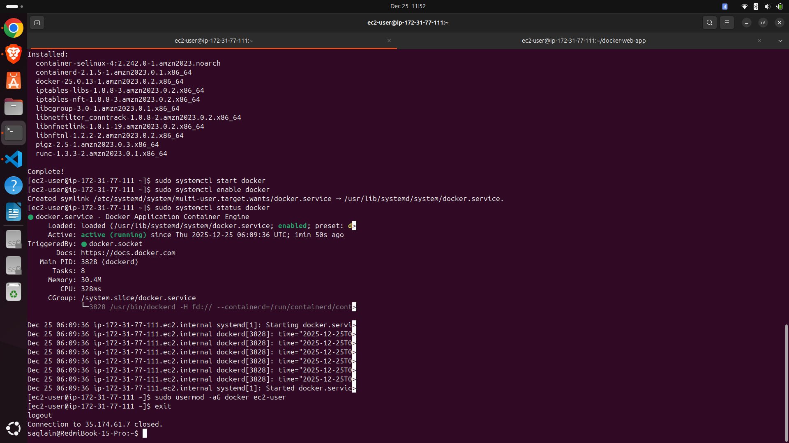
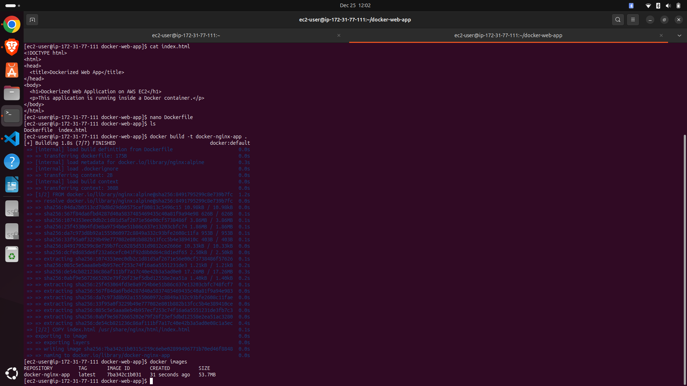
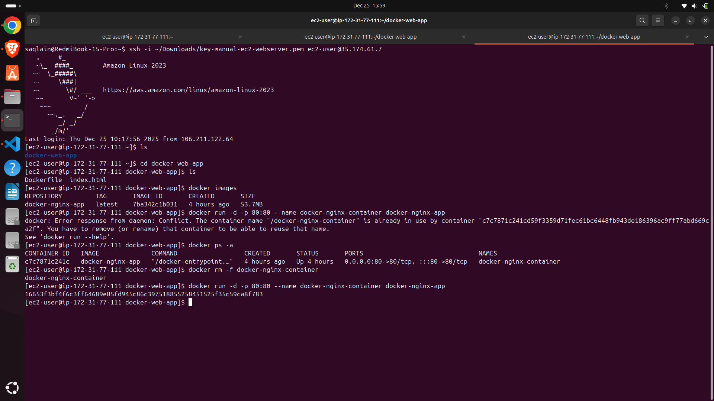
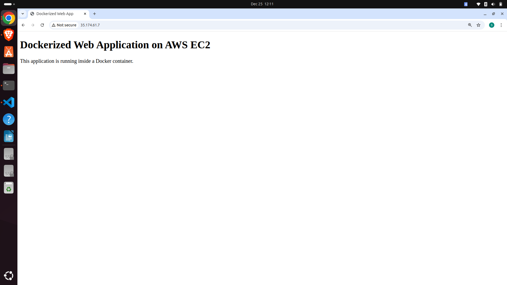

# Dockerized Web Application on AWS EC2

This project demonstrates deploying a Dockerized web application on an AWS EC2 instance. The application runs inside a Docker container using Nginx and is publicly accessible via the EC2 public IP.

---

## 🔧 Tech Stack

- AWS EC2
- Amazon Linux 2023
- Docker
- Nginx (Docker container)
- Linux
- AWS Security Groups

---

## 📌 Project Overview
The goal of this project was to understand container-based application deployment on cloud infrastructure. A static web application was packaged into a Docker image and deployed on an EC2 instance.

---

## 🛠️ Steps Performed

### 1. EC2 Instance Setup and networking configuration

- Launched EC2 instance using Amazon Linux 2023
- Configured key pair for secure SSH access
- Enabled public IPv4 address
- Configured Security Groups:
  - SSH (Port 22)
  - HTTP (Port 80)

### 2. Docker Installation

```bash
sudo dnf install docker -y
sudo systemctl start docker
sudo systemctl enable docker
sudo usermod -aG docker ec2-user
```

### 3. Application Setup

- Created a simple HTML application
- Used Nginx as the base Docker image

### 4. Dockerfile

```Dockerfile
FROM nginx:alpine
COPY index.html /usr/share/nginx/html/index.html
EXPOSE 80
```

### 5. Build & Run

```bash
docker build -t docker-nginx-app .
docker run -d -p 80:80 --name docker-nginx-container docker-nginx-app
```
---

## 🌐 Live Demo

**Public IP**: http://<EC2_PUBLIC_IP>

(Instance terminated after demonstration to avoid charges)

---

## 📷 Screenshots

#### EC2 instance running


#### Docker container running


#### Docker build output


#### Docker run output


#### Dockerized application page


---

## 🎯 Key Learnings

- Docker image and container lifecycle
- Port binding and conflict resolution
- Cloud-based container deployment
- Managing host services vs containers
- Running production-like workloads on EC2
